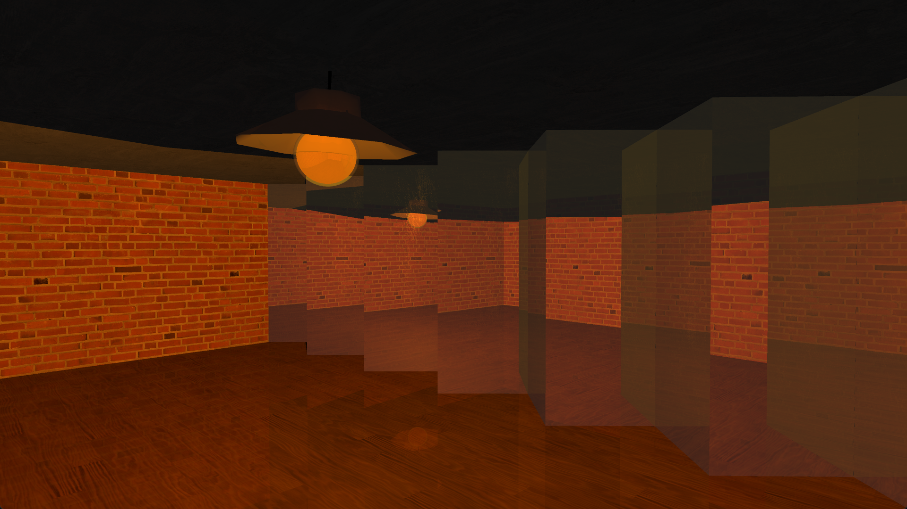
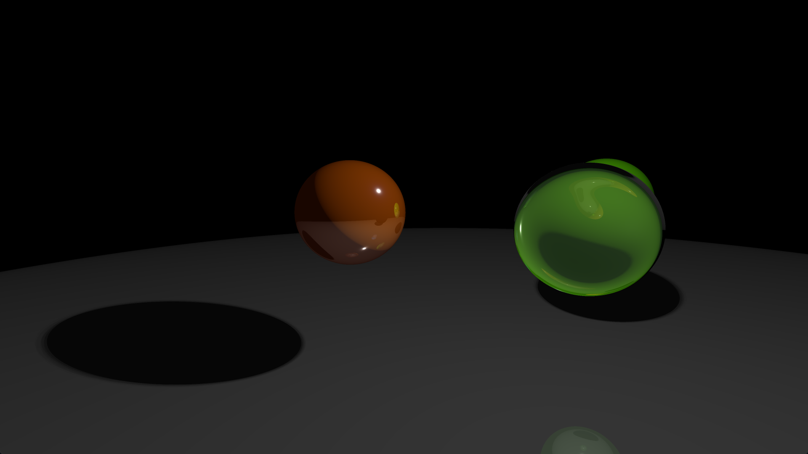
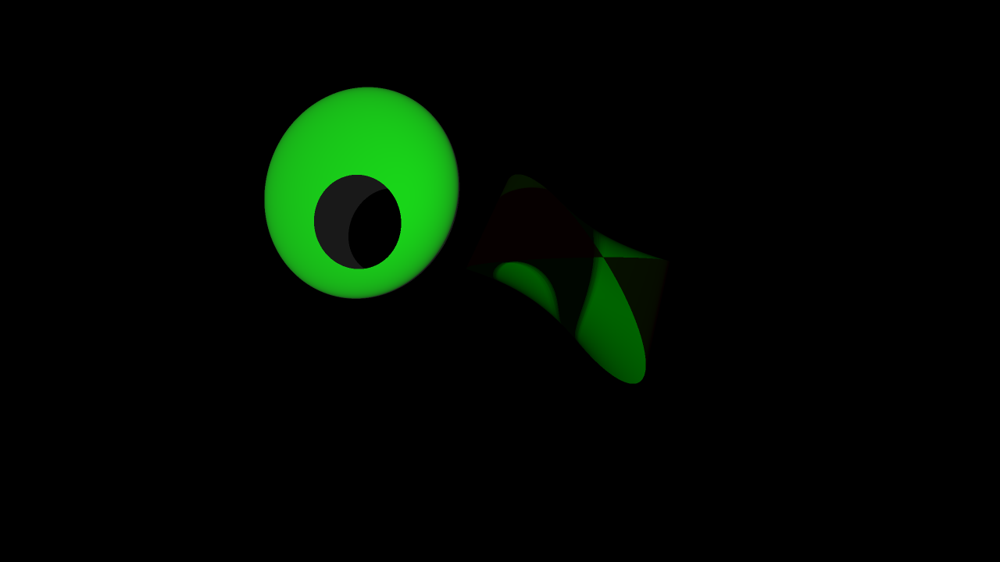
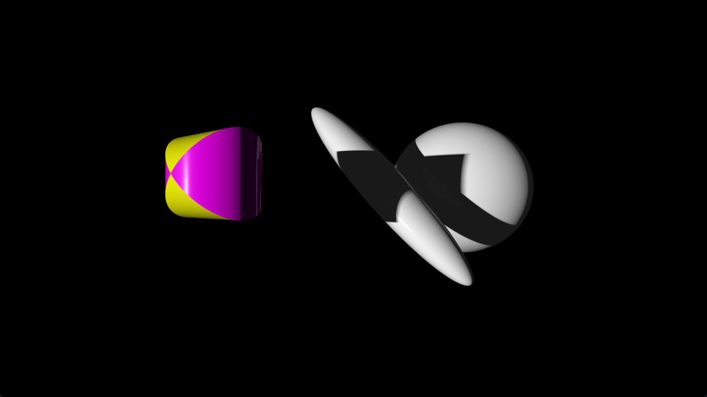

# OpenGL-Realtime-RT
This Java application renders raytraced 3D objects with reflections, refractions and shadows in realtime.
The rendering is handled through software raytracing via OpenGL.

  
  
  
  

Running the program requires a OpenGL 4.3 compatible GPU. If you want to try the program out without downloading the repository and compiling the program,
you can download [this zip archive](https://1drv.ms/u/c/a225810b411f051b/EaiviYQSUQpLkFYNQyHDpO4BTcS41JS3FmwQuADKWUgudw?e=4lzzD3) and run the executable contained in the extracted folder.
If you want to compile the program yourself, you will need a Java 17 JDK, like the one contained in the zip archive. 

Thanks go to my computer graphics teacher [Prof. Dr. Tobias Lenz](https://www.htw-berlin.de/hochschule/personen/person/?eid=9042) from the HTW, for getting me into computer graphics and helping me to realize the project.
Thanks as well to my friend [Bernd Reusch](https://www.linkedin.com/in/bernd-reusch/) for helping to implement the [WavefrontObjectReader class](https://github.com/Tizcommand/OpenGL-Realtime-RT/blob/main/src/io/WavefrontObjectReader.java).

# Controls

## Window

Press the left mouse button while hovering over the window content with the mouse cursor, to lock the mouse cursor into the window.

Press the left mouse button while the mouse is locked inside the window to unlock mouse cursor again.

Press Alt+Enter or F11 to toogle fullscreen mode.

## Camera

Move the mouse while the mouse cursor is locked inside the window to look around.

Hold W to move forward.

Hold A to move left.

Hold S to move backward.

Hold D to move right.

Hold space to move up.

Hold shift to move down.

Hold Alt while moving to move slowly.

Press Ctrl+R to reset the camera to its default position.

## Scenes

Press → to switch to the next scene.

Press ← to switch to the previous scene.

Press ↑ to switch to the next scene collection.

Press ↓ to switch to the previous scene collection.

Note that some scene collections contain scenes which are rendered via rasterization. These scenes are mostly used for testing purposes.

## Render Settings

### Scene Object Speed

Press Ctrl+↑ to increase the speed of scene objects.

Press Ctrl+↓ to decrease the speed of scene objects.

The speeds between which can be switched are 0x, 0.25x, 0.5x, 1x, 2x and 4x. The default speed is 1x.

### Framerate Limit

Press Ctrl+V to toogle VSync.

Press Alt+↑ to increase the framerate limit.

Press Alt+↓ to increase the framerate limit.

The limits between which can be switched are 30, 60, 120 and unlimited. The default limit is 60.
Note that you can only change the limit to 60 or 120 if your monitor's refresh rate is above 60 or 120 respectively, otherwise 60/120 are skipped when increasing or decreasing the limit.

### Render Resolution

Press Ctrl+D to toogle dynamic resolution scaling. The dynamic resolution scaler targets the framerate limit or the monitor's refresh rate if the framerate limit is set to unlimited.
Note that the dynamic resolution scaler can not target more than 250fps.

Press Ctrl+U to switch between nearest neighbour and linear upscaling.

Press Tab+↑ while dynamic resolution scaling is toogled off to increase the render resolution.

Press Tab+↓ while dynamic resolution scaling is toogled off to decrease the render resolution.

### Miscellaneous

Press Ctrl+L to toogle rendering of lights as visible objects. Lights used for ray tracing scenes are shown as spheres, while lights used for rasterizing scenes are shown as squares.
In the scene with lamp hanging from the ceiling, rendering of lights as visible objects is forced on.

Press Ctrl+G to toogle gamma correction.

Press Ctrl+A to toogle ambient light.

## Debug

Press F3 to toogle the visibility of debug information.

Press Ctrl+→ while debug information is visible to switch to the next type of debug information.

Press Ctrl+← while debug information is visible to switch to the previous type of debug information.
