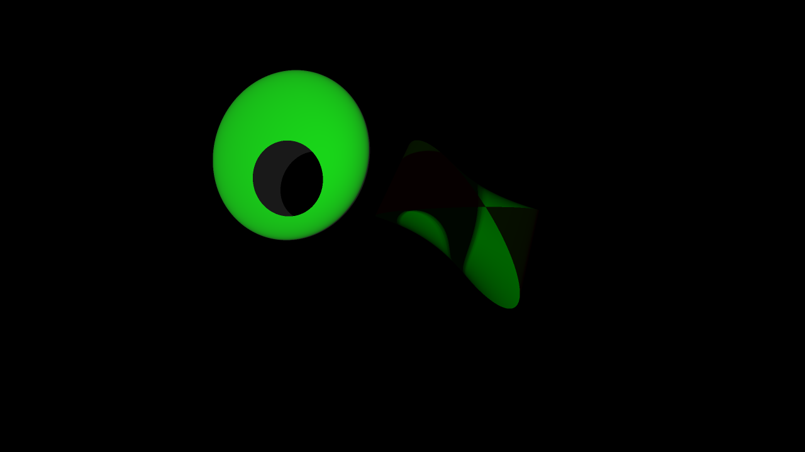

# OpenGL-Realtime-RT
This Java application renders raytraced 3D objects with reflections, refractions and shadows in realtime.
The rendering is handeled through software raytracing via OpenGL.

If you want to try the program out without downloading the repository and compiling the program,
you can download [this zip archive](https://1drv.ms/u/c/a225810b411f051b/EaiviYQSUQpLkFYNQyHDpO4BTcS41JS3FmwQuADKWUgudw?e=4lzzD3) extract it and run the executable contained within.
If you want to compile the program yourself, you will need a Java 17 JDK.

Thanks go to my computer graphics teacher [Prof. Dr. Tobias Lenz](https://www.htw-berlin.de/hochschule/personen/person/?eid=9042) from the HTW, for getting me into computer graphics and helping me realizing the project.
Thanks as well to my friend [Bernd Reusch](https://www.linkedin.com/in/bernd-reusch/) for helping to implement the [WavefrontObjectReader class]().
